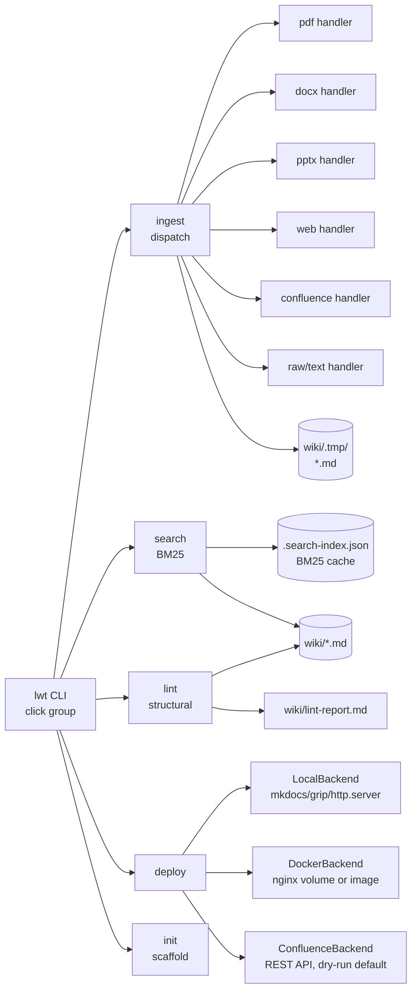

# llm-wiki-tools — Architecture

## Components

## External dependencies

- `pandoc` (optional) — preferred DOCX / PPTX converter; handlers fall back to `python-docx` / `python-pptx`.
- `pdftotext` (optional) — preferred PDF extractor; falls back to `pdfminer.six`, then `pypdf`.
- `trafilatura` / `requests` — web URL ingest.
- `mkdocs` / `grip` / `python3 -m http.server` — local deploy server selection, picked in that order by `shutil.which`.
- `docker` — docker deploy target (volume mode mounts `wiki/` read-only into `nginx:alpine:80`; image mode requires a `Dockerfile` at the wiki root).
- Confluence DC REST API — reached via `CONFLUENCE_URL` / `CONFLUENCE_TOKEN` / `CONFLUENCE_SPACE` env vars; push is gated behind `--no-dry-run`.
- `rank-bm25` — search indexer.
- `pyyaml`, `click` — frontmatter + CLI.

## Data flow

- **Ingest:** source file or URL → format dispatcher picks handler → markdown written to `wiki/.tmp/<name>.md` with traceability frontmatter (source path, SHA, backend, ingest command). Agent reads the temp file and writes real wiki pages.
- **Search:** `lwt search "<terms>"` loads or rebuilds `.search-index.json` (mtime-invalidated BM25), ranks pages, prints path + score + snippet.
- **Lint:** `lwt lint --structural` walks `wiki/`, reports broken `[[wiki-links]]`, orphans, missing pages → `wiki/lint-report.md`; exits 1 on findings.
- **Deploy:** `lwt deploy --target <local|docker|confluence>` dispatches to the backend. Confluence is dry-run by default; live push requires all three env vars and `--no-dry-run`.
- **Failure modes:** missing pandoc/pdftotext falls back silently; Confluence dry-run prints the page list; Docker image mode raises `FileNotFoundError` if no Dockerfile present.

## Where it runs

- Host(s): any workstation with Python 3.11+ (developed on Linux).
- Container(s): `nginx:alpine` for docker deploy target; no container for the CLI itself.
- Config files: `pyproject.toml` (entry point `lwt = llm_wiki.cli:main`); data repo uses `.lwt.env` for Confluence credentials (loaded from env, not auto-sourced).
- Secrets location: `CONFLUENCE_TOKEN` environment variable — kept out of repo; `.lwt.env.example` is the template.
- Default ports: local `8080`, docker `8443`.

## Related docs in this wiki

- None — this project is a standalone CLI; no Unraid, Home Assistant, or exposed-network entries apply.
