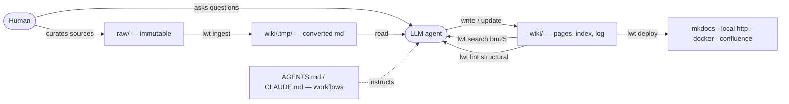
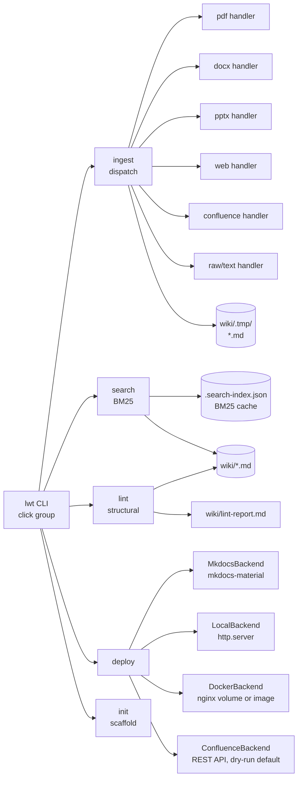

# llm-wiki-tools — Architecture

## Components

Three-layer pattern. The LLM owns `wiki/`; humans own `raw/` and the schema; `lwt` is dumb plumbing between them.

### CLI implementation view

## Two-repo layout

| Repo | Role | Versioning |
|---|---|---|
| `llm-wiki-tools` | Python package providing the `lwt` CLI, bundled templates, skills, and canonical `AGENTS.md`. Shared across all wiki instances. Located at `/path/to/llm-wiki-tools`. | Git, semver |
| `llm-wiki-<project>` | One per wiki instance. Contains `raw/`, `wiki/`, `templates/`, and a project-specific `CLAUDE.md`. Created via `lwt init`. | Git, per project |

Design artifacts (pattern document, system-design spec, implementation plans) live in `docs/superpowers/` and `docs/karpathy-llm-wiki.md`.

## Runtime dependencies

`llm-wiki-tools` v0.1.0 is installed and working. Core pip dependencies:

| System | What it provides | Delivery |
|---|---|---|
| Python 3.11+ | Runtime | System / pyenv |
| click | CLI framework | pip |
| pyyaml | Frontmatter parsing | pip |
| rank-bm25 | BM25 search index | pip |
| trafilatura + html2text | Web page → markdown | pip |
| requests | Confluence REST API | pip |
| pypdf + pdfminer.six | PDF → markdown fallback chain | pip |
| python-docx | DOCX → markdown | pip |
| python-pptx | PPTX → markdown | pip |
| pandoc (optional) | RST/Org → markdown (subprocess) | system |
| pdftotext / poppler (optional) | PDF → text (subprocess, primary) | system |

Optional extras:

| Extra | What it provides | Install |
|---|---|---|
| `mkdocs` | MkDocs Material site builder | `pip install "llm-wiki-tools[mkdocs]"` |

## Data flow

### `lwt ingest`

1. Human drops a source into `raw/` (PDF, DOCX, PPTX, markdown, or URL).
2. Human runs `lwt ingest raw/<file>` (or `lwt ingest https://...`).
3. `lwt` picks a format handler, converts to markdown, writes to `wiki/.tmp/<date>_<file>.md` with traceability frontmatter (source-SHA, backend, line count, lwt version).
4. LLM reads the temp file (chunked if >200 lines), writes/updates wiki pages, updates `wiki/index.md`, appends `wiki/log.md`.
5. `lwt` never writes to `wiki/` — exclusively the LLM's responsibility.

### `lwt search`

`lwt search <query> --wiki-dir wiki` runs BM25Plus over all `.md` files in `wiki/`, returns ranked `file:line` hits. LLM uses this to navigate large wikis without reading all pages.

### `lwt lint`

`lwt lint --structural` produces `file:line: message` findings: broken markdown links, pages referenced in index but missing, orphaned pages not in index. LLM follows up with semantic lint (contradictions, stale claims) in the agent session.

### `lwt deploy`

`lwt deploy --target mkdocs` (recommended): lazily generates `mkdocs.yml` beside `wiki/` using Material theme on first run, then serves or builds the site via subprocess. `--build` for static output, default `serve` for live dev.

## Where it runs

- **Development:** local laptop — `lwt ingest / search / lint / init` work today.
- **Serving:** `lwt deploy --target mkdocs --build` for static site; `lwt deploy --target docker` for HTTPS container on tardis.
- **Config files:** `.lwt.env` (credentials, gitignored) plus `AGENTS.md` / `CLAUDE.md` in the data repo.
- **Secrets:** `.lwt.env` — Confluence PAT, any future API tokens.
- **Default ports:** mkdocs `8000`, local `8080`, docker `8443`.

## Related docs

- Once a wiki instance is deployed to tardis, add an entry to `knowledge-base/docs/unraid/compose-stacks.md` and `network/exposed-services.md`.
